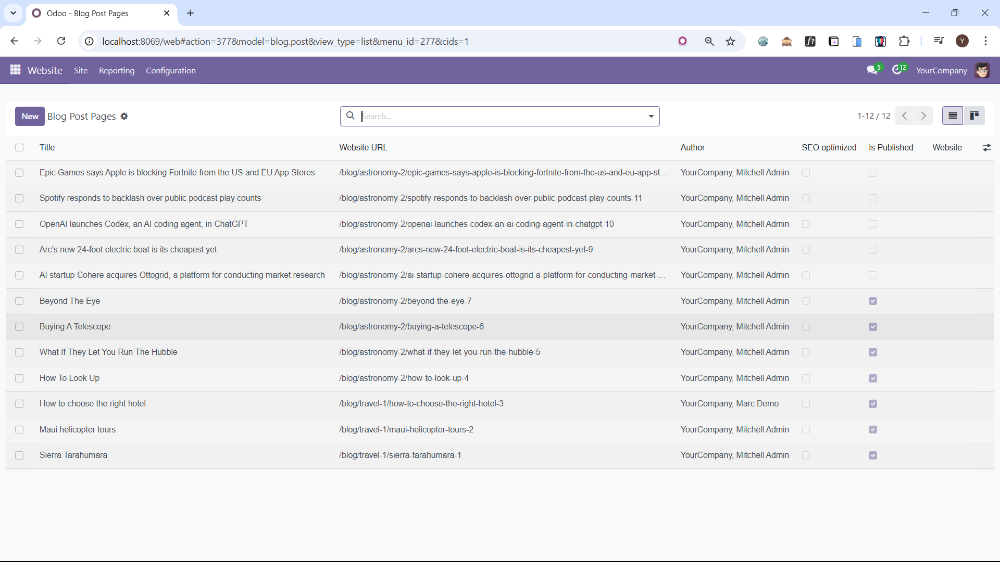
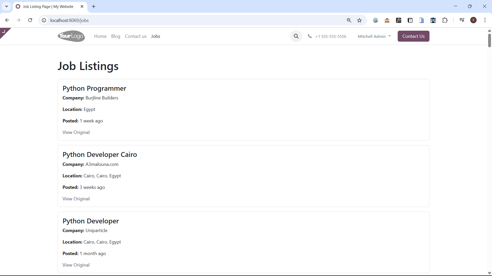
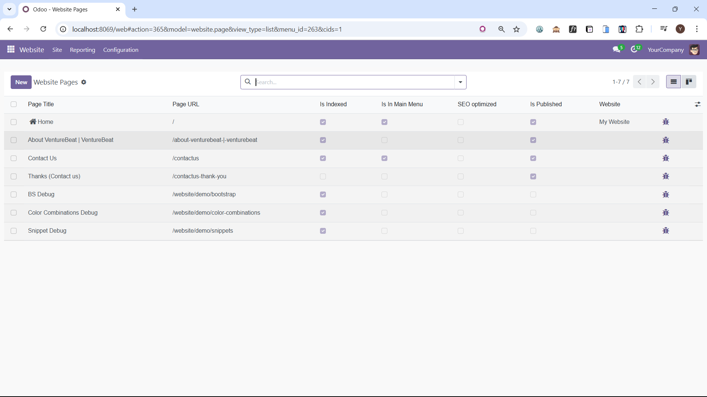

# 🚀 Odoo Developer Task: Web Scraping, API Integration & Custom Module

This README provides setup and usage instructions for a project that extracts data from external websites and integrates it into Odoo via a custom module and API.
---

## 📁 Project Structure

```
multi_website_odoo_integration/
├── scrapers/                       # Scraping scripts for each website
│   ├── scrape_linkedin.py
│   ├── scrape_techcrunch.py
│   └── scrape_venturebeat_about.py
├── pusher/
│   ├── push_to_odoo.py
│   └── .env
├── scraped_content/               # Custom Odoo module
│   ├── __manifest__.py
│   ├── __init__.py
│   ├── models/
│   │   ├── scraped_job.py
│   │   ├── scraped_blog.py
│   │   └── scraped_page.py
│   ├── views/
│   │   ├── scraped_job_views.xml
│   │   ├── scraped_blog_views.xml
│   │   └── scraped_page_views.xml
│   └── security/
│       └── ir.model.access.csv
├── data/                           # JSON outputs from scraping scripts
│   ├── linkedin_jobs.json
│   ├── techcrunch_blogs.json
│   └── venturebeat_about.json
├── screenshots/                   # Final output screenshots
├── README.md
└── .gitignore
```
---

## ✅ Setup Instructions

### 1. Clone the Repository

```bash
git clone https://github.com/yousefhanni/task_multi_website_odoo_integration.git
cd multi_website_odoo_integration
```

### 2. Set Up a Virtual Environment

```bash
python -m venv venv
source venv/bin/activate  # On Windows: venv\Scripts\activate
```

### 3. Install Project Dependencies

```bash
pip install -r requirements.txt
```

### 4. Install Scraping Dependencies

```bash
pip install selenium beautifulsoup4 requests
```

### 5. ChromeDriver Setup

1. Check your Chrome version from `chrome://settings/help`
2. Download the matching version from: https://googlechromelabs.github.io/chrome-for-testing/
3. Place the executable inside `scrapers/` folder.
   
> ℹ️ These dependencies and the ChromeDriver setup are required to run the scraping scripts located inside the `scraping_scripts/` folder.  
> The scripts use Selenium and BeautifulSoup to extract data from external websites like LinkedIn, TechCrunch, and VentureBeat.

---

## 🕷️ How to Run the Scrapers

Navigate to the `scrapers/` folder and run:

```bash
python scrape_linkedin.py
python scrape_techcrunch.py
python scrape_venturebeat_about.py
```

Each script generates its `.json` file in the `data/` folder.

---

## 📤 How to Run the Pusher Script

1. Make sure Odoo is running and the `scraped_content` module is installed.

2. Navigate to the `pusher/` folder and create a `.env` file with the following credentials:

```
ODOO_URL=http://localhost:8069
ODOO_DB=your_database_name_here
ODOO_USER=your_email_or_login_here
ODOO_PASSWORD=your_password_here
```

3. Then run:

```bash
python api_pusher.py
```

This script:
- Authenticates with Odoo via XML-RPC
- Pushes data to:
  - `scraped.job`
  - `scraped.blog` → and also into `website.blog.post`
  - `scraped.page` → and also into `website.page`
- Ensures idempotency and includes retry and error logging logic.
---

## 🧩 How to Install & Use the Odoo Module

1. Copy the `scraped_content/` folder into your Odoo custom addons path.
2. Update your `odoo.conf` file:

```ini
addons_path =addons_path = /your/custom/path/scraped_content
```

3. Restart the Odoo server
   
```bash
python odoo-bin -c odoo.conf
```
4. Activate Developer Mode in Odoo.
5. Go to **Apps** → Click **Update Apps List**
6. Search for `Scraped Content` and click **Install**

7. After installation, you’ll see a new menu:

**Scraping Manager** → Jobs / Blogs / Pages

---

## 🌐 How to See the Data on Website

- Blogs pushed to `website.blog.post` appear under **Website > Blog**
- Pages pushed to `website.page` appear under **Website > Pages**
- Custom Job Listing Page appears at: `http://localhost:8069/jobs`

To navigate to it:
1. Go to **Website > Site > Menu Editor**
2. Add `/jobs` as a new menu entry pointing to the job page.

---

## 📸 Screenshots

### 🔹 Jobs List (Backend)


### 🔹 Job Detail (Backend)


### 🔹 Blog List (Backend)


### 🔹 Blog Detail (Backend)


### 🔹 VentureBeat Page List (Backend)


### 🔹 VentureBeat Page Detail (Backend)


### 🔹 Blogs Published on Website


### 🔹 Custom Job Listing Page (Website)


### 🔹 Pages Published on Website



## 📩 Contact

For support: ytaha6368@gmail.com
