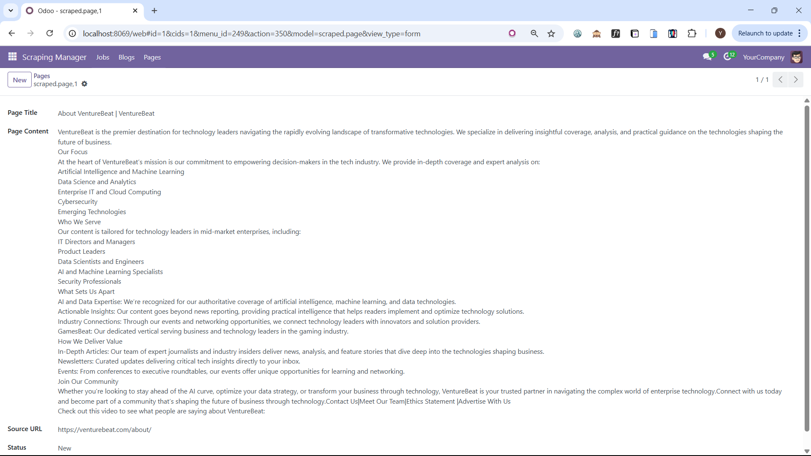

# 🚀 Odoo Developer Task: Web Scraping, API Integration & Custom Module

This project integrates web-scraped content into a custom Odoo module via API.  
It includes:

- Web scraping scripts (LinkedIn Jobs, TechCrunch Blogs, VentureBeat Pages)
- A custom Odoo module (`scraped_content`)
- An API pusher script to send data to Odoo
- Structured JSON output
- Full setup and usage instructions

---

## 🧭 How This Project Works

The project is organized into three main components:

1. **Web Scraping Scripts** (`scraping_scripts/`)  
   - Run to extract data from LinkedIn, TechCrunch, and VentureBeat  
   - Output is saved as `.json` files inside the `data/` folder

2. **Custom Odoo Module** (`scraped_content/`)  
   - Installed in your Odoo server to display and manage scraped data

3. **API Pusher** (`api_pusher.py`)  
   - Reads the `.json` files and sends the data to Odoo using XML-RPC API  
   - ⚠️ You must update the script with your Odoo credentials

---

## 📁 Project Structure

```
multi_website_odoo_integration/
├── api_pusher.py
├── data/
│   ├── linkedin_jobs.json
│   ├── techcrunch_blogs.json
│   └── venturebeat_about.json
├── scraping_scripts/
│   ├── scrape_linkedin.py
│   ├── scrape_techcrunch.py
│   ├── scrape_venturebeat_about.py
├── scraped_content/
│   ├── __manifest__.py
│   ├── __init__.py
│   ├── models/
│   ├── views/
│   └── security/
└── screenshots/              # Output UI screenshots from Odoo after pushing the data
    ├── jobs_linkedin_in_odoo.png
    ├── blogs_techcrunch_in_odoo.png
    ├── page_venturebeat_in_odoo.png
    ├── job_form_detail.png
    └── blog_form_detail.png
```

---

## ✅ Setup Instructions

### 1. Clone the Repository

```bash
git clone https://github.com/yousefhanni/task_multi_website_odoo_integration.git
cd multi_website_odoo_integration
```

### 2. Set Up a Virtual Environment

```bash
python -m venv venv
source venv/bin/activate  # On Windows: venv\Scripts\activate
```

### 3. Install Project Dependencies

```bash
pip install -r requirements.txt
```

### 4. Install Scraping Dependencies

```bash
pip install selenium beautifulsoup4 requests
```

### 5. ChromeDriver Setup

1. Check your Chrome version from `chrome://settings/help`
2. Download the matching version from: https://googlechromelabs.github.io/chrome-for-testing/
3. Place `chromedriver` inside the `scraping_scripts/` folder

> ℹ️ These dependencies and the ChromeDriver setup are required to run the scraping scripts located inside the `scraping_scripts/` folder.  
> The scripts use Selenium and BeautifulSoup to extract data from external websites like LinkedIn, TechCrunch, and VentureBeat.

---

## 🕷️ How to Run the Scrapers

Navigate to the `scraping_scripts/` folder and run:

```bash
python scrape_linkedin.py
python scrape_techcrunch.py
python scrape_venturebeat_about.py
```

Each script generates its `.json` file in the `data/` folder.

---

## 🧩 How to Install & Use the Odoo Module

1. Copy the `scraped_content/` folder into your Odoo custom addons path.
2. Update your `odoo.conf` file:

```ini
addons_path = /path/to/odoo/addons,/path/to/multi_website_odoo_integration/scraped_content
```

3. Restart the Odoo server:

```bash
python odoo-bin -c odoo.conf
```

4. Activate Developer Mode in Odoo.
5. Go to **Apps** → Click **Update Apps List**
6. Search for `Scraped Content` and click **Install**

7. After installation, you’ll see a new menu:

**Scraping Manager** → Jobs / Blogs / Pages

---

## 📤 How to Push Data to Odoo

1. Make sure Odoo is running and the `scraped_content` module is installed.
2. Open `api_pusher.py` and update the following values:

```python
url = "http://localhost:8069"
db = "your_db_name"
username = "your_username"
password = "your_password"
```

3. Run the script:

```bash
python api_pusher.py
```

The script will:
- Authenticate using XML-RPC
- Push data to Odoo using `scraped.job`, `scraped.blog`, and `scraped.page` models

---

## 📸 Screenshots




---

## 📩 Contact

For support: ytaha6368@gmail.com
